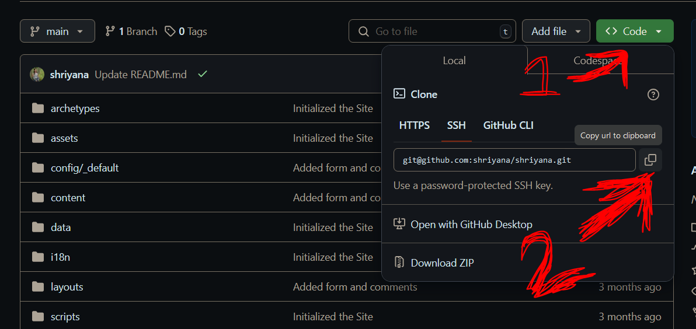

### From Losing Code to Learning Git and GitHub

When I first started working on coding projects, I could barely keep track of my files. My desktop was a mess, I was constantly overwriting old versions of my work, and worst of all, I kept losing important code. It was chaos. That’s when I learned about Git, a version control system, and GitHub, a platform to store and collaborate on code.

### My Struggles With Git

At first, Git was incredibly confusing. I had no idea what I was doing. Words like "repository," "commit," and "push" seemed like alien concepts. I was dragging files around, trying to make sense of it all, but I felt more lost than ever.

One day, I decided to tackle my confusion step by step. I started by learning how to clone a repository. Here’s what I discovered:

1. Go to the GitHub repository you want to clone.
2. Click the green **Code** button and copy the URL.

3. On your local computer, navigate to the folder where you want the repository to appear.
4. Right-click and open the terminal.
5. Use the command:
   ```bash
   git clone URL_you_just_copied
   ```

This simple process was a game changer. For the first time, I could pull down code from GitHub to my local machine.

### Uploading Files to GitHub

Initially, I had no idea how to upload my files. My early process looked something like this:

1. Initialize an empty repository on GitHub.
2. Clone the empty repository to my local machine.
3. Copy all my files into the cloned folder.
4. Run these commands:
   ```
   git init
   git add .
   git commit -m "added files"
   git push
   ```

While this worked, it was overly complicated. Over time, I learned a more efficient workflow:

1. Create a remote repository on GitHub.
2. In your local project folder, run these commands:
   ```
   git init
   git add .
   git commit -m "Added files"
   git branch -m main
   git remote add origin REMOTE_REPOSITORY_URL
   git push -u origin main
   ```

This approach saved me so much time and effort.

### Exploring Advanced Git Commands

Once I mastered the basics, I started exploring more advanced Git features:

- **git log**: This command shows the history of commits, helping me keep track of changes.
- **git status**: A lifesaver when I need to see which files have been modified or staged.
- **Branches**: I’ve started using branches to work on new features without affecting the main code.
- **Reverting Changes**: Learning how to go back in time using Git has been incredibly useful.

### Final Thoughts

Learning Git and GitHub has been a journey, but it’s been worth it. I’ve gone from losing code to managing projects with confidence. If you’re struggling with Git, don’t give up. Take it one step at a time, and soon you’ll be a version control pro!
