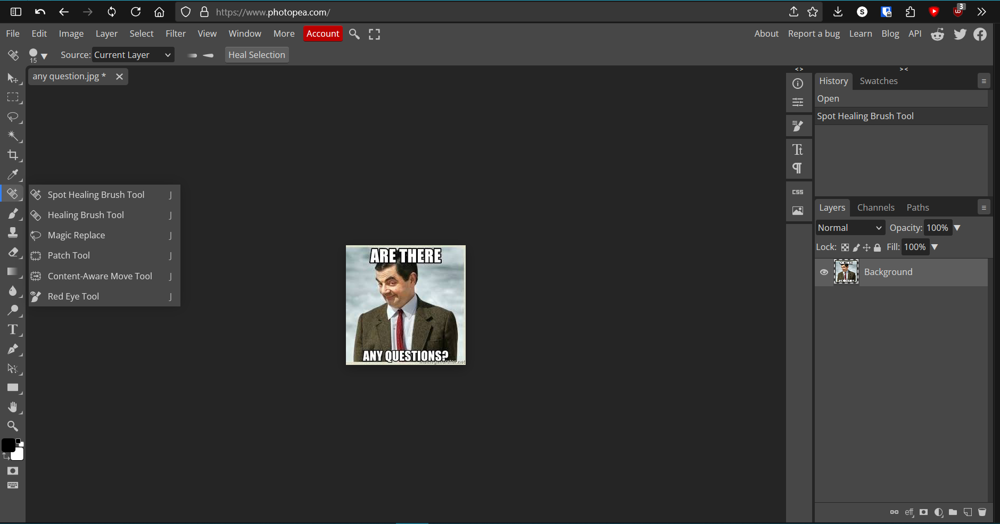

### Discovering Photopea

As someone who loves experimenting with design but doesn’t always want to commit to expensive software, I recently stumbled upon [Photopea](https://www.photopea.com/), a free, browser-based Photoshop alternative. At first, I was skeptical. Could a web app really match up to the power of Photoshop? I decided to give it a shot, and here’s what I found.

### My Initial Thoughts

Opening Photopea for the first time was a pleasant surprise. The interface looked remarkably similar to Photoshop, complete with familiar tools like layers, selection tools, and blending modes. Unlike some other free tools I’ve tried, Photopea didn’t feel clunky or oversimplified.

### Getting Started

To get started with Photopea, all you need is a web browser and an internet connection. Here’s how simple it is:

1. Visit [Photopea](https://www.photopea.com/) in your browser.
2. Upload an image from your computer or create a new project.
3. Start editing using the toolbar on the left and the layers panel on the right.

Here’s a screenshot of the Photopea interface to give you an idea:

### Features I Loved

1. **Layer Management**: Just like Photoshop, you can create, edit, and organize layers with ease.
2. **Advanced Tools**: Tools like the pen tool, clone stamp, and gradient editor worked seamlessly.
3. **File Compatibility**: Photopea supports PSD files, meaning you can open and save files that are compatible with Photoshop.
4. **No Installation Needed**: Since it’s browser-based, there’s no need to install anything—a huge plus for quick edits on the go.

### Limitations

While Photopea is impressive, it’s not without limitations. Complex projects with very large files can sometimes lag, and it lacks some of the advanced features available in paid software. However, for most casual users and even some professionals, it’s more than sufficient.

### Why You Should Try It

If you’re looking for a free, accessible alternative to Photoshop, Photopea is worth exploring. Whether you’re a beginner in graphic design or a seasoned pro looking for a quick editing tool, this web app delivers.

Here’s another example of what you can create with Photopea:

### Final Thoughts

Photopea exceeded my expectations in many ways. It’s powerful, user-friendly, and completely free. If you’re tired of expensive subscriptions or just need a quick and efficient tool, give Photopea a try. You might be surprised by how much you can accomplish!

Let me know about your experience with Photopea in the comments or reach out if you have any tips or tricks to share!
